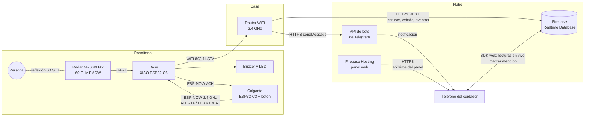

# Arquitectura

## Bloques y enlaces

## Enlaces

| Enlace | Medio | Contenido | Documento |
|---|---|---|---|
| Radar -> persona | 60 GHz FMCW | Micro-movimiento del pecho | |
| Radar -> base | UART0 dentro del kit (GPIO17/16, 115200) | Fases, respiración, latido, presencia, distancia | `radar.md` |
| Colgante <-> base | ESP-NOW sobre 802.11, 2.4 GHz | Paquetes de 8 bytes, ACK de aplicación | `protocolo.md` |
| Base -> router | WiFi 802.11 en modo STA | | |
| Base -> Firebase | HTTPS, API REST de Realtime Database | JSON | `modelo-datos.md` |
| Base -> Telegram | HTTPS, API de bots (`sendMessage`) | Texto | |
| Panel <-> Firebase | HTTPS / WebSocket (SDK web) | Lecturas en vivo, eventos | `modelo-datos.md` |

La base usa la misma radio de 2.4 GHz para ESP-NOW y para WiFi. Por eso el colgante tiene que
transmitir en el canal del router (ver `protocolo.md`, sección Canal de radio).

Las conexiones HTTPS validan el certificado del servidor con los certificados raíz incluidos en el
firmware. No se desactiva la verificación (`setInsecure()`), porque por ese canal viajan el token
de Firebase y el del bot.

## Por qué la base habla directo con Telegram

El plan Spark no incluye Cloud Functions, así que Firebase no puede reaccionar a un evento y mandar
el aviso. La base envía el mensaje de Telegram por su cuenta, en paralelo a escribir el evento en
Firebase. Ventaja adicional: si Firebase falla, el aviso igual sale.

## Por qué no MQTT

Se evaluó usar MQTT (base publicando a un broker, y un servicio aparte que guarde datos y mande
avisos). Se descartó para esta entrega:

- Necesita más piezas: un broker (en una computadora de la casa o un servicio en la nube) y un
  programa que se suscriba para guardar historial y mandar notificaciones. Cada pieza es algo más
  que instalar, mantener encendido y que puede fallar.
- Firebase ya da en un solo servicio gratuito la base de datos, el hosting del panel y la
  autenticación. Telegram resuelve la notificación sin servidor propio.
- Con el tiempo disponible (entrega el 24 de octubre de 2026) es más seguro tener menos
  componentes y menos puntos de falla.

Lo que se pierde frente a MQTT: cada envío por HTTPS es más pesado que una publicación MQTT sobre
una conexión abierta, y no hay un canal sencillo para mandar órdenes a la base. Hoy la base no
necesita recibir órdenes. MQTT queda como alternativa evaluada si en una versión futura se necesita
control remoto de la base o menor latencia.
