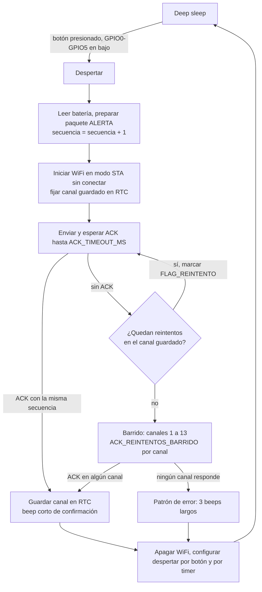

# Protocolo del enlace colgante -> base (ESP-NOW)

Definición en código: `firmware/comun/protocolo/protocolo.h`. Si este documento y el header no
coinciden, manda el header y hay que corregir este documento.

## 1. Capa de transporte

- ESP-NOW sobre 802.11 en 2.4 GHz, sin asociarse a un punto de acceso.
- El colgante envía en **unicast** a la MAC de la base (configurada en `secrets.h` del colgante).
  Con unicast, la capa MAC de 802.11 confirma la trama y el callback de envío informa si llegó al
  radio de la base. Eso no garantiza que el firmware de la base la haya procesado; por eso existe
  además el ACK de aplicación descrito abajo.
- La base responde en unicast a la MAC de origen del colgante.
- Cifrado ESP-NOW (PMK/LMK): no se usa en la primera versión. Queda como mejora.

## 2. Formato del paquete

8 bytes, `__attribute__((packed))`, enteros en little-endian (orden nativo del ESP32-C3 y C6).

| Byte | Campo | Tipo | Descripción |
|---|---|---|---|
| 0 | `version` | uint8 | Versión del protocolo. Hoy `1`. La base descarta otras versiones. |
| 1 | `tipo` | uint8 | `1` = ALERTA, `2` = HEARTBEAT, `3` = ACK |
| 2 | `id_dispositivo` | uint8 | Id del colgante. En un ACK, id del colgante al que se responde. |
| 3 | `flags` | uint8 | Bits, ver tabla siguiente |
| 4-5 | `secuencia` | uint16 LE | Contador del colgante. El ACK repite la secuencia que confirma. |
| 6-7 | `bateria_mv` | uint16 LE | Batería del colgante en mV. `0` en un ACK. |

Flags en mensajes del colgante:

| Bit | Nombre | Significado |
|---|---|---|
| 0 | `FLAG_BATERIA_BAJA` | `bateria_mv` < `BATERIA_BAJA_MV` |
| 1 | `FLAG_REINTENTO` | Retransmisión de un mensaje ya enviado (misma secuencia) |
| 2 | `FLAG_BARRIDO` | Enviado durante el barrido de canales |
| 3 | `FLAG_ARRANQUE_FRIO` | Primer mensaje tras encender o reiniciar; la secuencia volvió a empezar |
| 4-7 | | Reservados, en 0 |

Flags en el ACK:

| Bit | Nombre | Significado |
|---|---|---|
| 0 | `FLAG_ACK_DUPLICADO` | La base ya había procesado esa secuencia y no volvió a disparar la alerta |
| 1-7 | | Reservados, en 0 |

Ejemplo: alerta del colgante 2, secuencia 300 (0x012C), 3950 mV (0x0F6E), sin flags:

```
01 01 02 00 2C 01 6E 0F
```

ACK correspondiente:

```
01 03 02 00 2C 01 00 00
```

## 3. Constantes

| Constante | Valor inicial | Uso |
|---|---|---|
| `CANAL_POR_DEFECTO` | 1 | Canal si el colgante no tiene uno guardado |
| `CANAL_MIN` / `CANAL_MAX` | 1 / 13 | Rango del barrido |
| `ACK_TIMEOUT_MS` | 100 ms | Espera del ACK en el canal guardado |
| `ACK_REINTENTOS` | 3 | Envíos en el canal guardado antes de barrer |
| `ACK_TIMEOUT_BARRIDO_MS` | 50 ms | Espera del ACK por canal en el barrido |
| `ACK_REINTENTOS_BARRIDO` | 2 | Envíos por canal en el barrido |
| `HEARTBEAT_INTERVALO_S` | 900 s (15 min) | Periodo del heartbeat |
| `COLGANTE_AUSENTE_S` | 2700 s | Sin mensajes en este tiempo, la base marca el colgante como ausente |
| `BATERIA_BAJA_MV` | 3500 mV | Umbral de batería baja. Por confirmar con una curva de descarga medida. |

Los tiempos son valores de partida. Se ajustan midiendo la latencia real del ACK con el hardware
(se registra en `pruebas/`).

Peor caso de tiempo con radio encendido en una alerta sin respuesta:
3 x 100 ms + 13 canales x 2 x 50 ms = 1.6 s, más el tiempo de arranque de WiFi.

## 4. Flujo de una alerta



Detalles:

1. El colgante despierta por nivel bajo en el pin del botón. En el ESP32-C3 solo GPIO0-GPIO5
   pueden despertar desde deep sleep.
2. La secuencia se incrementa una vez por mensaje nuevo. Los reintentos usan la misma secuencia
   con `FLAG_REINTENTO`, así la base los reconoce como duplicados.
3. Un ACK solo es válido si `tipo == MSG_ACK`, `id_dispositivo` es el del colgante y `secuencia`
   coincide con la enviada. Cualquier otro paquete se ignora.
4. Confirmación: un beep corto. Error: tres beeps largos, para que la persona sepa que debe
   volver a intentarlo o pedir ayuda de otra forma.
5. Antes de dormir se configura el despertar por botón y por timer (`HEARTBEAT_INTERVALO_S`).
6. Si el botón sigue presionado al terminar, se espera a que se suelte antes de dormir, para no
   despertar de inmediato en bucle.

El heartbeat sigue el mismo flujo con `tipo = MSG_HEARTBEAT`, pero sin sonido en ningún caso:
un heartbeat perdido no debe despertar a la persona. Si falla, el colgante solo vuelve a dormir;
la base detecta la ausencia por `COLGANTE_AUSENTE_S`.

## 5. Duplicados y número de secuencia

El colgante guarda `secuencia` en memoria RTC (`RTC_DATA_ATTR`), que se conserva durante el deep
sleep pero se pierde al quitar la batería o reiniciar por completo.

La base guarda, por cada `id_dispositivo`, la última secuencia procesada (en RAM).

Al recibir un mensaje del colgante, la base:

1. Valida `version` y `tipo`.
2. Si trae `FLAG_ARRANQUE_FRIO`, olvida la secuencia guardada para ese colgante y lo acepta como
   nuevo.
3. Compara con la última secuencia usando aritmética de 16 bits con signo, para tolerar el
   desborde de 65535 a 0:
   `nueva = (int16_t)(secuencia - ultima) > 0`.
4. Si es nueva: procesa (alerta local, Firebase, Telegram) y guarda la secuencia.
5. Si no es nueva: no vuelve a procesar.
6. En ambos casos responde ACK. Si era repetida, con `FLAG_ACK_DUPLICADO`.

Siempre se responde ACK aunque sea duplicado: el caso típico es que el ACK anterior se perdió y el
colgante reintentó. Si no se le responde, terminaría barriendo canales y dando el patrón de error
aunque la base sí recibió la alerta.

Si la base se reinicia, pierde las secuencias en RAM y acepta como nuevo el siguiente mensaje de
cada colgante. Lo peor que pasa es una alerta repetida, que es preferible a perder una.

## 6. Canal de radio

### Problema

ESP-NOW solo funciona si emisor y receptor están en el mismo canal. La base está conectada al
router en modo STA, y en ese modo su radio queda en el canal del router; no puede elegir otro.
Si el router cambia de canal (muchos lo hacen solos al reiniciarse o por selección automática), la
base cambia con él y el colgante deja de alcanzarla.

### Solución

1. El colgante guarda el último canal en el que recibió un ACK en memoria RTC.
2. Cada envío empieza en ese canal (o `CANAL_POR_DEFECTO` si no hay ninguno guardado).
3. Si tras `ACK_REINTENTOS` no hay ACK, barre los canales `CANAL_MIN` a `CANAL_MAX`, enviando el
   mismo mensaje (misma secuencia, con `FLAG_BARRIDO`) y esperando `ACK_TIMEOUT_BARRIDO_MS` en
   cada uno.
4. El primer canal que responde se guarda en RTC y se usa en adelante.

Como el barrido reenvía la misma secuencia, si la base recibió el mensaje en un intento anterior y
solo se perdió el ACK, la base lo trata como duplicado y no repite la alerta.

Optimización posible: en unicast, el callback de envío de ESP-NOW indica si la trama recibió el ACK
de capa MAC. En un canal equivocado ese callback falla rápido, así que el barrido puede pasar al
siguiente canal sin esperar todo `ACK_TIMEOUT_BARRIDO_MS`. Por confirmar con el módulo cuánto
tiempo ahorra.

### Requisitos en la base

- Ahorro de energía de WiFi desactivado (`WiFi.setSleep(false)`). Con el modem en ahorro de energía
  la base puede perder tramas ESP-NOW.
- Cuando la base pierde WiFi y está reintentando conectarse, su radio cambia de canal mientras
  busca el router. Durante ese tiempo el colgante puede no encontrarla. Ver `docs/fallos.md`.
- Por confirmar con el módulo: el XIAO ESP32-C6 tiene selector de antena (interna/externa). Hay que
  verificar cuál usa el kit MR60BHA2 y configurarla al arrancar.
